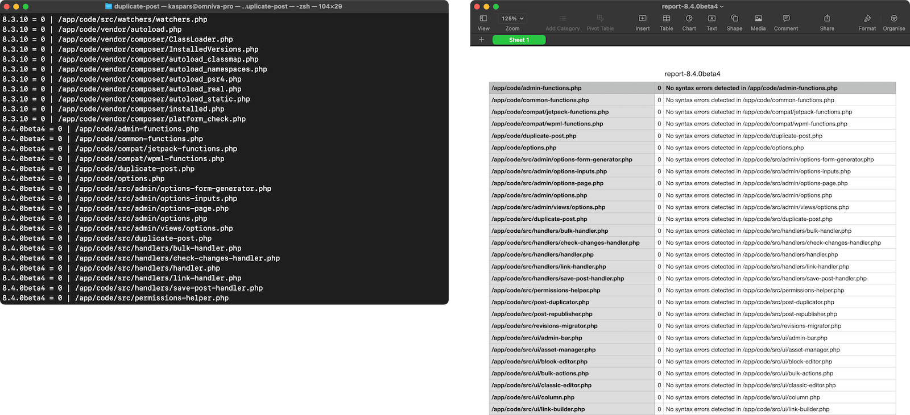

# PHP Multi Linter 🍍🍊🍋

A docker image with multiple PHP CLI versions and a [`lint.php`](lint.php) script that runs `php -l` for all files in the `/app/code` directory using each of the included PHP CLI binaries.

Similar tools:

- [`php-parallel-lint`](https://github.com/php-parallel-lint/PHP-Parallel-Lint) which provides extensive controls over `php -l` and runs it in parallel.

- [`phpqa` Docker image](https://github.com/jakzal/phpqa) which includes dozens of PHP tools.

## Usage

Navigate to your PHP project and run:

    docker run --rm -v .:/app/code ghcr.io/kasparsd/php-multi-linter:latest

which mounts the current working directory into `/app/code` inside the container and runs the bundled `lint.php` against all files in the directory.

Results are stored in `report-PHPVERSION.csv` files for each PHP version in the current directory.

### Runing Locally

1. Build the image locally using `docker compose build`.

2. Run linter against the files in the `./code` directory which is the default behaviour:

      docker compose run --rm php-multi-linter

2. Run `docker compose run php-multi-linter php7.4 lint.php ./tests` to run a report on the `tests` directory.

## Credits

Created by [Kaspars Dambis](https://kaspars.net).